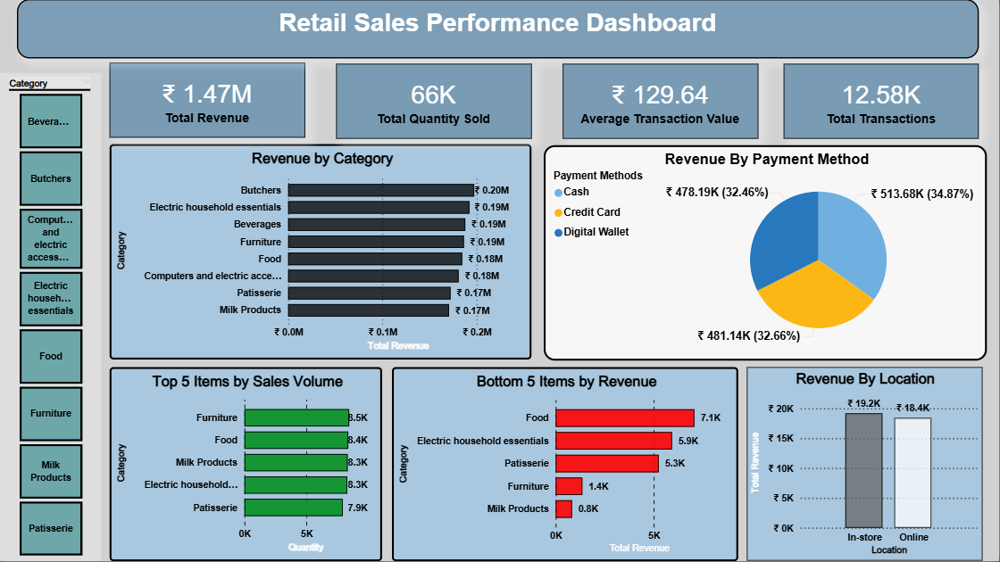

# Retail Sales Performance Analysis

## 📌 Project Overview
This project analyzes retail sales data to understand revenue trends, product performance, and customer payment behavior across online and offline channels.  
The goal is to help business stakeholders make data-driven decisions using clear KPIs and dashboards.

---

## ❓ Business Problem
The retail business wants to:
- Track total revenue and sales quantity
- Identify top and underperforming product categories
- Compare online vs offline store performance
- Understand customer payment preferences

---

## 📂 Dataset
- Source: Kaggle (Retail Sales Dataset)
- Format: CSV
- Records: 12,000+ transactions

### Key Columns
### Data Dictionary
| Column | Description |
|--------|-------------|
| invoice_id | Unique transaction identifier |
| category | Product category |
| sales | Revenue for each transaction |
| quantity | Units sold |
| payment_method | Cash/Card/UPI |
| channel | Online/Offline store |

---

## 🛠 Tools Used
- Excel – Data cleaning
- SQL Server – KPI calculations
- Power BI – Dashboard & visualization
- GitHub – Version control

---

## 📊 Key KPIs
- Total Revenue
- Total Quantity Sold
- Average Transaction Value
- Category-wise Sales Performance
- Payment Method Distribution

---

## 📈 Dashboard Preview

---

## 🚀 How to Run This Project
1. Clone the repository
2. Import CSV files from `/data` into SQL Server
3. Run `01_load_and_clean.sql`
4. Run `02_calculate_kpis.sql`
5. Open Power BI file from `/powerbi`
6. Refresh data and explore dashboards

---

## Key Insights
- Online sales contributed **56% of total revenue**, while offline stores contributed 44%.
- UPI accounted for **45% of total transactions**, with the highest average order value.
- Category "Electronics" generated the most revenue, while "Stationery" showed a consistent decline.

---

## 📌 Conclusion
This project demonstrates end-to-end data analysis skills including data cleaning, SQL querying, KPI development, and dashboard creation.

